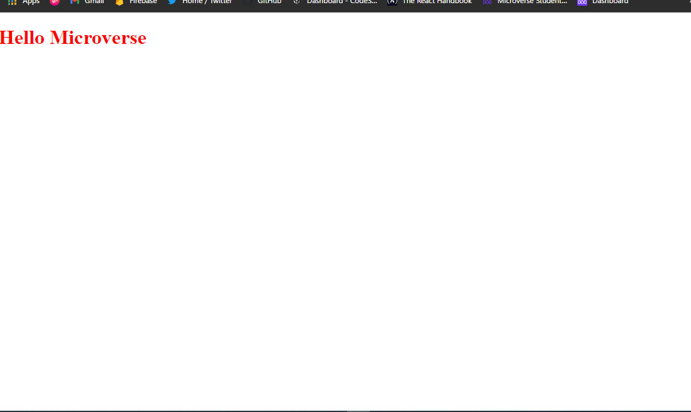

# Microverse Hello Project

> Description the project.

In this project i am going to create a simple webpage that displays "Hello Microverse" in the color red, using the tools and best practices about git and github flow to complete the project.

## Built With

- Html
- CSS
- Git

## Authors

👤 **Ssegawa Alvin Louis**

- GitHub: [@githubhandle](https://github.com/alvinlouis29)
- Twitter: [@twitterhandle](https://twitter.com/louisssegawa)
- LinkedIn: [LinkedIn](https://www.linkedin.com/in/alvin-louis-k-632026183/)

## 🤝 Contributing

Contributions, issues, and feature requests are welcome!

Feel free to check the [issues page](../../issues/).

## Show your support

Give a ⭐️ if you like this project!

## Acknowledgments

- Hat tip to anyone whose code was used
- Inspiration
- etc

## 📝 License

This project is [MIT](./MIT.md) licensed.
